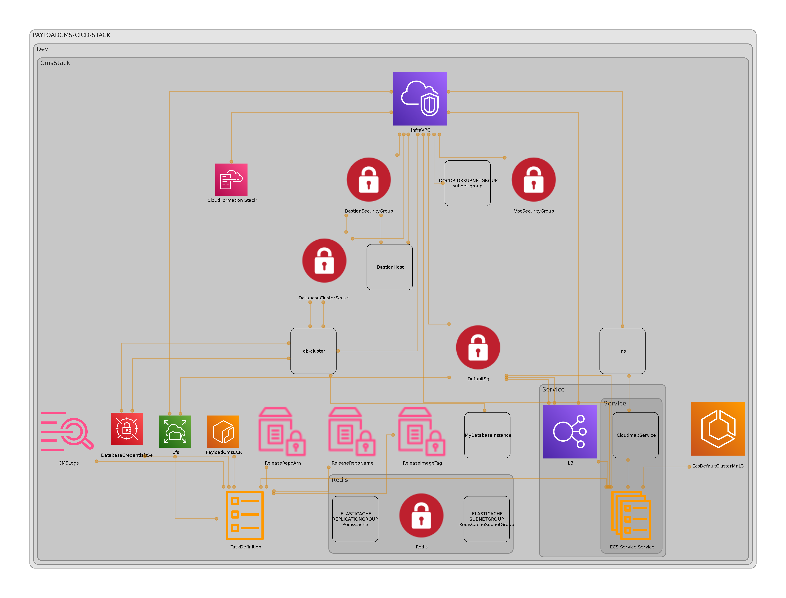

# Summary



## Secrets

We are currently storing the initial admin user secrets in the config.yml, here is the reasons as to why this was done like that:

AWS Fargate integrates with secrets manager natively, AWS Lambda doesn't support secrets or SSM natively at all.

In AWS Fargate, one can simply point it to a secret, specify a field in the secret. it'll read it and inject it into application's environment automatically.

That doesn't exist in AWS Lambda and this is redundant for a few reasons:

1. It puts the value in plain text. This means the value for `ENV_VAR_KEY` will be visible in plain text in the `synthesized stack`/`cloudformation`.
2. We'll have to re-deploy the stack to update the value for an environment variable. It's not going to use the `new` value in future execution after only updating AWS SSM parameter.
3. We'll have to do some thing and create `N` SSM parameters, 1 for each Environment variable.
If we modify the value in config.yml, It'll not be updated in SSM and I am not sure if the reference to this secret will use the value from config.yml or if it'll fetch it again from SSM.

Testing the above doesn't work, either:

1. Deploy stack
2. Change value in AWS SSM
3. Deploy it again

The stack sets the AWS Lambda `ENV` using `SSM` parameter and it keeps using the old value instead of using the `new`/`updated` value. There are settings to specify a version of `SSM` parameter but there is no "LATEST" tag and the version has to be specified manually.

Specifying it manually will not work for similar reasons. It'll keep using the `old`/`initial` value for SSM rather than using the `new`/`updated` value. This is because CDK keeps using the same version for stability rather than looking up the latest version and using that.

> We should lockdown the `/admin` endpoint behind WAF as this is already implemented, but has been [disabled](./src/waf.ts#L106)

## EFS

Launch the EC2 in the same VPC as the EFS.
Make sure the EC2 instance has an entry for the Security Group for `All Traffic` and as the `Source` add the SG for the EFS
Take the EFS `DNS Name`

```terminal
sudo yum -y install nfs-utils
mkdir ~/efs-mount-point
sudo mount -t nfs -o nfsvers=4.1,rsize=1048576,wsize=1048576,hard,timeo=600,retrans=2,noresvport fs-005c6d07a9efa6727.efs.eu-west-1.amazonaws.com:/ ~/efs-mount-point
```

## WAF Rules

We are currently implementing 5. Waf Rules, these are:

1. AWS Managed Rules

   | Name                           | Description                                                                                                    | Example                                                                  | Rule action                    | Enabled |
   | ------------------------------ | -------------------------------------------------------------------------------------------------------------- | ------------------------------------------------------------------------ | ------------------------------ | ------- |
   | NoUserAgent_HEADER             | Requests without a user agent header                                                                           | `curl -H "Host: example.com" http://example.com`                         | Use action defined in the rule | &#9745; |
   | UserAgent_BadBots_HEADER       | Requests with a bad bots user agent header                                                                     | `curl -A "BadBot" http://example.com`                                    | Use action defined in the rule | &#9745; |
   | SizeRestrictions_QUERYSTRING   | Requests with a size restriction on the query string                                                           | `curl "http://example.com/?param1=value1"`                               | Use action defined in the rule | &#9746; |
   | SizeRestrictions_Cookie_HEADER | Requests with a size restriction on the cookie header                                                          | `curl -b "cookie=value" http://example.com`                              | Use action defined in the rule | &#9745; |
   | SizeRestrictions_BODY          | Requests with a size restriction on the request body                                                           | `curl -X POST -d "data" http://example.com`                              | Override: Count                | &#9746; |
   | SizeRestrictions_URIPATH       | Requests with a size restriction on the URI path                                                               | `curl http://example.com/very/long/path`                                 | Use action defined in the rule | &#9745; |
   | EC2MetaDataSSRF_BODY           | Requests with a Server-Side Request Forgery (SSRF) vulnerability in the request body targeting EC2 metadata    | `curl -X POST -d "data" http://example.com/ssrf`                         | Use action defined in the rule | &#9745; |
   | EC2MetaDataSSRF_COOKIE         | Requests with a Server-Side Request Forgery (SSRF) vulnerability in the cookie targeting EC2 metadata          | `curl -b "cookie=value" http://example.com/ssrf`                         | Use action defined in the rule | &#9745; |
   | EC2MetaDataSSRF_URIPATH        | Requests with a Server-Side Request Forgery (SSRF) vulnerability in the URI path targeting EC2 metadata        | `curl http://example.com/ssrf/endpoint`                                  | Use action defined in the rule | &#9745; |
   | EC2MetaDataSSRF_QUERYARGUMENTS | Requests with a Server-Side Request Forgery (SSRF) vulnerability in the query arguments targeting EC2 metadata | `curl "http://example.com/ssrf?param=value"`                             | Use action defined in the rule | &#9745; |
   | GenericLFI_QUERYARGUMENTS      | Requests with a Local File Inclusion (LFI) vulnerability in the query arguments                                | `curl "http://example.com/?file=../../../../etc/passwd"`                 | Use action defined in the rule | &#9745; |
   | GenericLFI_URIPATH             | Requests with a Local File Inclusion (LFI) vulnerability in the URI path                                       | `curl http://example.com/../etc/passwd`                                  | Use action defined in the rule | &#9745; |
   | GenericLFI_BODY                | Requests with a Local File Inclusion (LFI) vulnerability in the request body                                   | `curl -X POST -d "data" http://example.com/?file=../../../../etc/passwd` | Use action defined in the rule | &#9745; |
   | RestrictedExtensions_URIPATH   | Requests with restricted file                                                                                  | `curl <http://example.com/index.php.bak>`                                | Use action defined in the rule | &#9745; |

2. AWS AnonIPAddress - IP address that does not reveal the true identity or specific information about the user or device associated with it. - `curl --header "X-Forwarded-For: 203.0.113.0" <http://example.com> - &#9746;`

3. AWS IP reputation List - IP addresses maintained by AWS, which includes known malicious or suspicious IP addresses. - &#9745;

4. GeoBlock from accessing gateway - - &#9745;

   | Country Code |
   |--------------|
   | CN           |
   | NZ           |
   | PL           |
   | US           |

5. Custom - Restrict access to all paths under /admin to the ip addreseses in allowedIPSet - this has been disabled until we get a VPN - &#9746;

### Signed URL

```terminal
aws s3 presign s3://mybucket/myobject --expires-in 300
```
